<h1 align="center">
  
</h1>

  
  
  

---

<table align="center" width="100%">
<tr>
<td width="50%" align="center">
  
</td>
<td width="50%" align="center">
  
</td>
</tr>
</table>

---

## 🏆 Trophies

  

  

---

## 🎓 Certifications & Achievements

| Certificate | Issuer |
|-------------|--------|
|  |  |
|  |  |
|  |  |
|  |   |
| 🐧 Proficient in Linux for AWS DevOps |  |
| ☁️ AWS DevOps Certified |  |
|  |  |

---

## 🛠️ Tech Stack

### ☁️ Cloud & Infrastructure

  
  

### ⚙️ CI/CD

  
  
  

### 🐳 Containers & Orchestration

  
  
  
  
  

### 🏗️ IaC & Security

  
  
  
  
  
  

### 📊 Monitoring

  
  
  

### 💻 Programming & Scripting

  
  
  

### 🔧 Tools & Platforms

  
  
  
  
  
  

---

## 📈 GitHub Stats

  
  

  

---

## 📊 Activity Graph

  

---

## 🤝 Connect with Me

  
  
  
  

---

  

